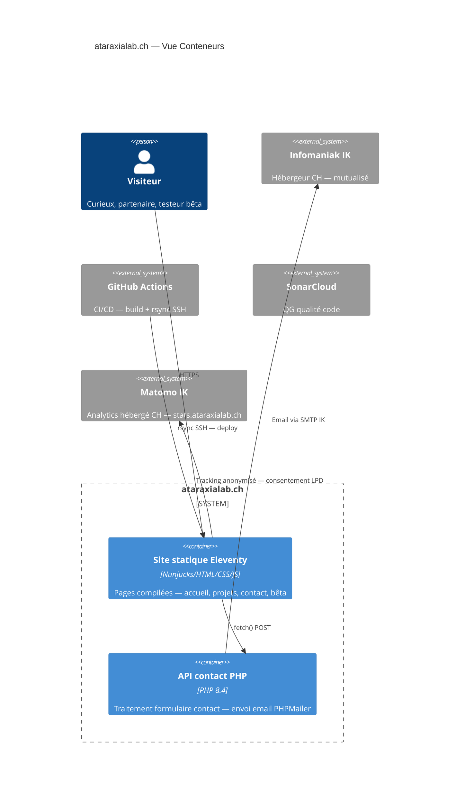

# ARCHITECTURE — ataraxialab.ch
**Association Ataraxia Lab — CHE-425.759.729 — Le Locle NE**
_v1.0 — 15.08.2026_

> Ce fichier est **obligatoire** dans tout repo/module Ataraxia Lab.
> Vérifié par CI (`doc-check.yml`) et par `rag_manager.py --checkout`.

---

## §1 CONTEXTE

**À quoi ça sert :** Vitrine institutionnelle de l'Association Ataraxia Lab — présente l'association, ses membres, ses projets (Ataraxia SEO, AtxCron, Ataraxia Creations), et permet le contact.

**Pour qui :** Visiteurs externes, partenaires potentiels, utilisateurs cherchant à comprendre qui est derrière les outils.

**Périmètre strict :**
- Présentation institutionnelle (mission, membres, statuts)
- Liste des projets/outils avec liens
- Trust-bar et signaux de confiance (CHE, LPD, hébergement CH)
- Formulaire de contact
- Page bêta (accès restreint aux testeurs)

**Hors périmètre :**
- Fonctionnalités SaaS (voir seo.ataraxialab.ch)
- Gestion des membres/cotisations
- Blog ou publication régulière de contenu

**Statut :** Production

**Lien produit :** https://ataraxialab.ch

---

## §2 CONTENEURS

---

## §3 DÉCISIONS

### ADR-01 — Site statique sans CMS
- **Contexte :** Vitrine associative avec contenu stable — pas besoin de CMS.
- **Options :** WordPress vs Eleventy statique vs Hugo.
- **Décision :** Eleventy — cohérence avec seo.ataraxialab.ch, 0 surface d'attaque CMS.
- **Conséquences :** Mises à jour via git + CI. Pas de backend sauf formulaire contact.
- **Date :** 2026-04-20 — **Statut :** Actée

### ADR-02 — Analytics Matomo hébergé IK (pas Google Analytics)
- **Contexte :** Obligation nLPD + positionnement "hébergé en Suisse".
- **Options :** Google Analytics vs Matomo cloud vs Matomo self-hosted IK.
- **Décision :** Matomo sur stats.ataraxialab.ch (IK) — données restent en Suisse.
- **Conséquences :** Consentement double opt-in requis. Données jamais transférées hors CH.
- **Date :** 2026-04-20 — **Statut :** Actée

### ADR-03 — JSON-LD Organization + SoftwareApplication pour SEO institutionnel
- **Contexte :** Visibilité dans les moteurs pour l'entité juridique et les outils.
- **Options :** Métadonnées basiques vs Schema.org structuré.
- **Décision :** Schema.org complet — `Organization`, `SoftwareApplication`, `dateModified` dynamique.
- **Conséquences :** Meilleure visibilité AEO/GEO. Maintenance à chaque mise à jour.
- **Date :** 2026-08-14 — **Statut :** Actée

---

## §4 CONTRAINTES

**Contraintes techniques :**
- PHP 8.4 (IK mutualisé) — formulaire contact uniquement
- Pas de BDD — site entièrement statique
- nav.js en `defer` obligatoire (BP#133)

**Contraintes légales (nLPD) :**
- Formulaire contact : conservation emails 12 mois max, base légale = intérêt légitime
- Matomo : consentement opt-in, données anonymisées, hébergé CH
- Page mentions légales obligatoire (art. 13 LPD)

**Contraintes éditoriales :**
- Cohérence avec la charte graphique de l'association
- Tout contenu validé par le Comité avant publication

---

## §5 QUALITÉ

**Critères de "terminé" :**
- [x] Sonar QG : Security A · Reliability A · Maintainability A
- [x] `rag_manager.py --checkout` → PASS
- [x] CI GitHub Actions verte
- [x] Score PageSpeed ≥ 90 mobile et desktop
- [x] Toutes les images OG présentes (9 images)

**Monitoring :**
- NinjaFirewall (WordPress rectoverso.online surveille aussi ce domaine)
- DMARC rapports hebdomadaires
- `dateModified` mis à jour dynamiquement par CI

---

## §6 OPÉRATIONS

**Déploiement :**
- Pipeline : GitHub Actions → Eleventy build → rsync SSH IK
- Commande : `git push` → CI déploie automatiquement
- Fichiers hors CI : aucun (site entièrement statique)

**Secrets :**
- GitHub Secrets : SSH_HOST, SSH_USER, SSH_PRIVATE_KEY
- Aucun secret applicatif (pas de BDD, pas d'API tier)

**Crons actifs :**
| Nom | Fréquence | Rôle |
|---|---|---|
| CRON_BACKUP_ATARAXIALAB | 02h00 | Backup fichiers site (à créer — ACT pending) |

**Accès SSH :**
- Hôte : `gy877v.ftp.infomaniak.com` port 22
- User : `gy877v_ataraxialab`
- Racine IK : `/home/clients/d70b8cc9ac817101013710f75218a5cd/sites/ataraxialab.ch/`

---

## §7 CONFORMITÉ

| Table / Flux | Données personnelles | Base légale | Conservation | Transfert tiers |
|---|---|---|---|---|
| Formulaire contact | Email, nom, message | Intérêt légitime (art. 6 al. 4 let. f LPD) | 12 mois | Aucun (SMTP IK CH) |
| Matomo analytics | IP anonymisée, navigation | Consentement (art. 6 al. 6 LPD) | 13 mois | Aucun (IK CH) |

**Registre des traitements :** `administration/association_lpd_conformite.md`

**Points ouverts LPD :** Aucun

---

*ARCHITECTURE.md — ataraxialab.ch — v1.0 — 15.08.2026*
*Document obligatoire — vérifié par CI doc-check.yml + rag_manager.py --checkout*
